v# DataBricksCICD
Devops pipeline for Databricks
# Introduction to Notebook Promotion Pipeline

Welcome to the Notebook Promotion Pipeline! This pipeline streamlines the process of promoting notebooks across different environments in your Azure Databricks workspace. Whether you're moving from development to staging or staging to production, this pipeline automates the deployment process, ensuring consistency and reliability in your notebook deployments.

## Key Features:

- **Environment-Agnostic Configuration:** The pipeline is designed to be environment-agnostic, allowing you to promote notebooks seamlessly across different environments without the need for environment-specific configurations.

- **Flexible Promotion:** Whether you're promoting individual notebooks or entire folders, this pipeline offers flexibility in promoting your assets, accommodating various deployment scenarios.

- **Version Control Integration:** Integrated with version control systems such as Azure Devops, the pipeline ensures that all changes to notebooks are tracked and auditable, providing transparency and accountability throughout the deployment process.

- **Promotion to Enviornments:** Incorporating ADO Environments approval checks to control deployments to production environments.

- **Customizable Deployment Strategy:** Tailor the deployment strategy to suit your organization's specific requirements, whether it's a continuous deployment approach or a scheduled release cycle.

## Pipeline Structure:

- **Source Stage:** Fetches the notebooks from the source environment, typically the development environment, and triggers the deployment process.

- **Promotion Stages:** Consists of one or more stages representing the target environments (e.g., staging, production). Each stage deploys the notebooks to the respective environment, following the defined deployment strategy.

# Prerequisites for Running the Pipeline

Before running the pipeline, ensure the following prerequisites are completed:

## Databricks Provisioning

- **Databricks Environment:** Databricks needs to be provisioned and configured properly. The pipeline is designed to work with two Databricks environments. These environments can be hosted within the same resource group or in different resource groups.

## Service Principal Configuration

- **Service Principal:** A service principal with appropriate permissions is required to access the Databricks workspace. Ensure that the service principal is created and has the necessary permissions to interact with the Databricks environment.
  
  ```bash
az ad sp create-for-rbac --name databricksp  


- Note: Replace `databricksp` with the desired name for your service principal.
Notedown or copy the response of sp create command.

Next, assign the role of Owner to the service principal created in the previous step. The role assignment is need to access workspace.


az role assignment create --assignee 9e61579c-d1bb-4299-ba46-6db7e7cbbefc --role "Owner" --scope "/subscriptions/8eb3a86f-dd3a-4484-8026-f893a7e5e5ac/resourceGroups/ceidbdemo/providers/Microsoft.Databricks/workspaces/databricksdemoprod"


- Replace `9e61579c-d1bb-4299-ba46-6db7e7cbbefc` with the Service Principal's Application ID created in the previous step, and adjust the `--scope` parameter to match your specific Databricks workspace resource.
Databricks 
Once Service principal role assignment done successfully, head to Databricks cluster and launch Databricks workspce. Service  Principal have to be set with propert entitlements and add as well as an user.

- Select Admin Settings 

'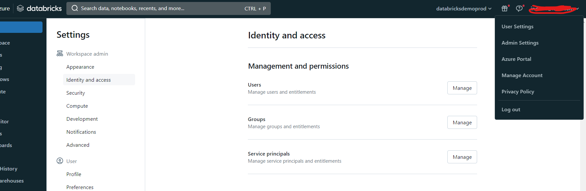'  


- Select Identity And Access and Service Principal


'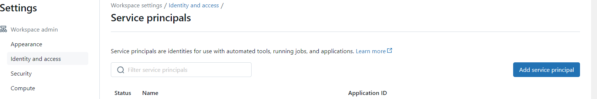'  

-You should find the service principal listed, as it holds the owner role for the workspace. Simply locate it through the search functionality and proceed to add it.


'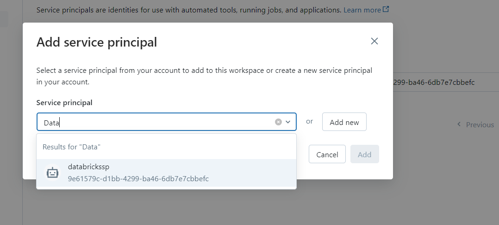'  

Assign Databricks Entitlements 

'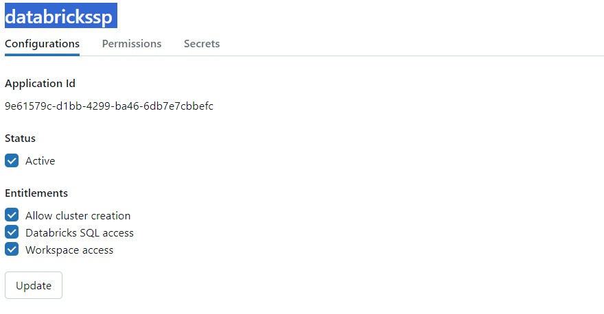'  

Configure Service Princiapl as a user and assign roles
'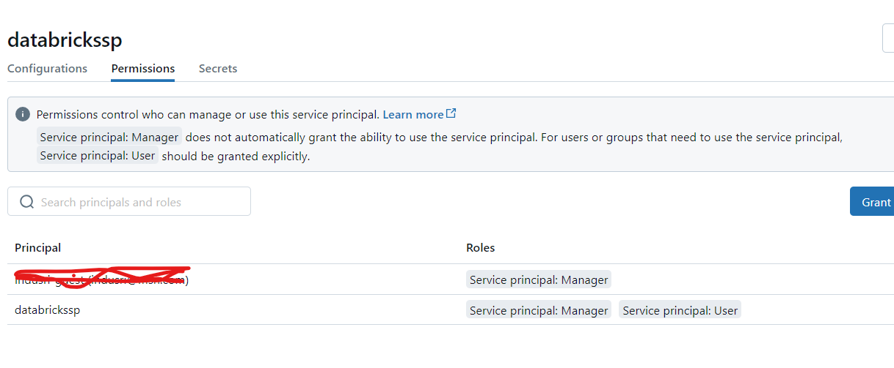'


## Databricks Repo Configuration

- Steps to configure Databricks repo configuration with ADO Devops is not covered .
- After pipeline successful run, Notebooks will be deployed to a folder called 'Live' 
'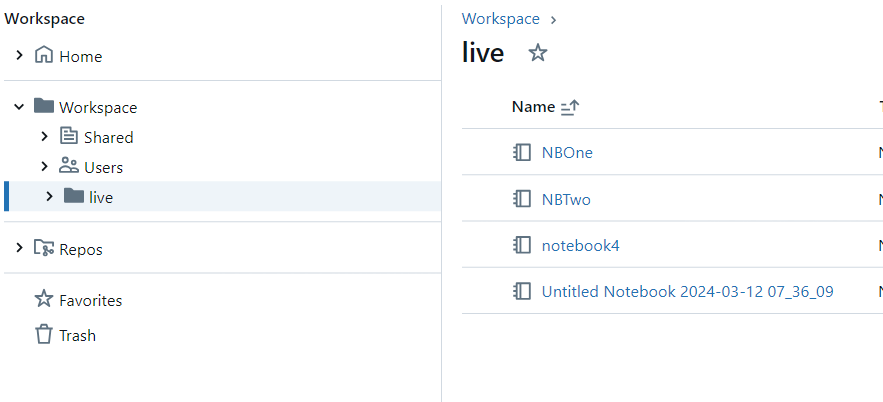'

## Getting Started:

To get started with the Notebook Promotion Pipeline, simply configure the pipeline parameters to match your environment settings and deployment preferences. Once configured, trigger the pipeline manually or automate it to run on commits. Pramameter values are read from ADO Environment variables.
Pipeline parameters are read from an Azure DevOps Variable Group. Create a variable group and define variables to store the following information:

- Resource Group Name(s)
- Azure DevOps Service Agent Name
- Azure DevOps Environment Names: One for each deployment environment
- Service Principal ID
- Service Principal Secret: Store the service principal secret value with type 'Secret'.

'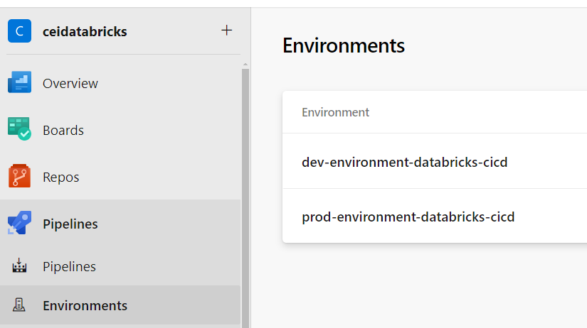'

-## Define variable groups

'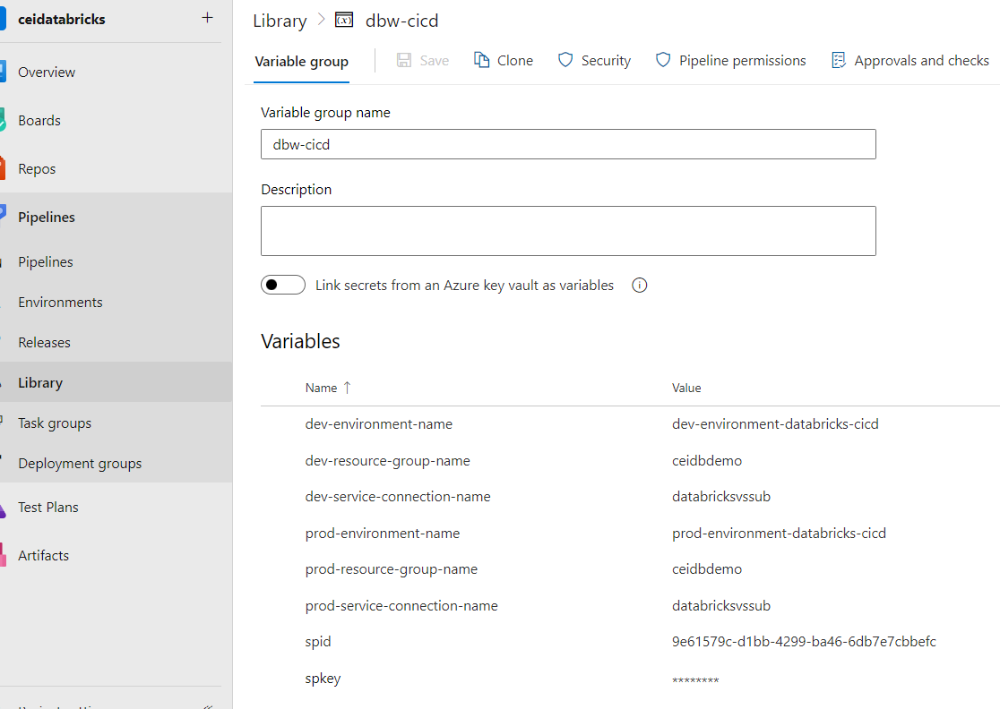'  
## Databricks Pipeline:
Pipeline has 3 files - azure-pipelines.yml, databricks-token.ps1 and databricks-notebooks.yml
- azure-pipelines.yml  
 The main entry point of Azure DevOps pipeline for deploying notebooks to different environments using templates.The pipeline is designed to promote notebooks from development to production, but can be modified to add more environments. It uses templates for deployment, making it modular and reusable. Ensure that the variable values are properly defined in your Azure DevOps environment and that the template deploy-notebooks.yml contains the necessary logic for deploying notebooks to the specified environments.  
 The pipeline is triggered on the main branch and relies on variables from a variable group named dbw-cicd, setting vmImagename to "windows-latest" and leaving notebooksPath initially empty(since notebooks for the demo are in the root path). It utilizes a VM image specified by vmImageName in the pool. The pipeline consists of two stages: Deploy_to_Dev and Deploy_to_Prod. In Deploy_to_Dev, notebooks are deployed to the development environment using the deploy-notebooks.yml template, with parameters defining various aspects such as environmentName, resourceGroupName, serviceConnection, notebooksPath, spid, spkey, and workspaceName. Similarly, the Deploy_to_Prod stage deploys notebooks to the production environment, depending on the completion of the "Deploy_to_Dev" stage. Both stages utilize the same template and parameter structure but with environment-specific values for parameters.
- databricks-notebooks.yml
The provided YAML defines parameters for a deployment pipeline, including stageId, dependsOn, env, environmentName, resourceGroupName, serviceConnection, notebooksPath, spid, spkey, and workspaceName. The pipeline stages deploy Databricks notebooks to specified environments. The deployment process leverages an Azure CLI task to fetch the Databricks workspace information, including the workspace name and details. It then installs necessary modules, retrieves a bearer token using a PowerShell script, and imports notebooks to the Databricks workspace. The script's execution depends on the provided parameters, such as resource group name, service connection, and workspace name.
- databricks-token.ps1
 The PowerShell script provided generates a token from a Databricks endpoint. It takes parameters including databricksWorkspaceResourceId, databricksWorkspaceUrl, tokenLifeTimeSeconds (defaulting to 300), spid, and spkey. The script initiates by setting necessary variables such as endpoint URLs and headers. It then sends HTTP requests to Azure AD and Azure Resource Manager endpoints to obtain access and management tokens, respectively. The obtained tokens are used to authenticate and authorize requests to the Databricks API. Finally, the script sends a request to the Databricks API to generate a bearer token with a specified lifetime. The resulting bearer token is returned by the script.

## Successful Deployment:
On Successful run of pipline , will result in promoting the notebooks from the main repository to Live folder of Dev and Prod instance of Databricks.
'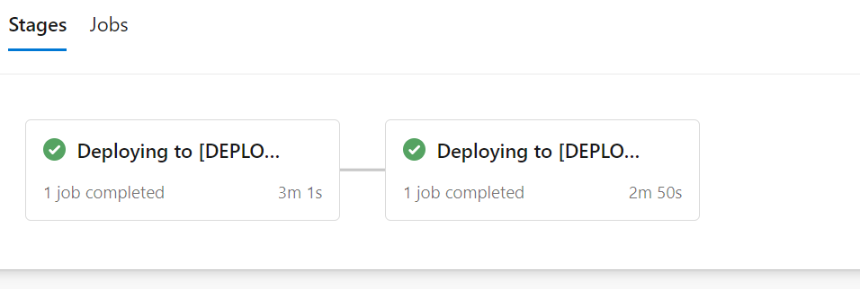'  
'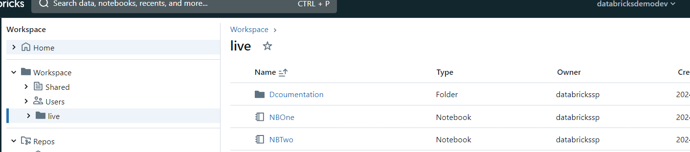'  
'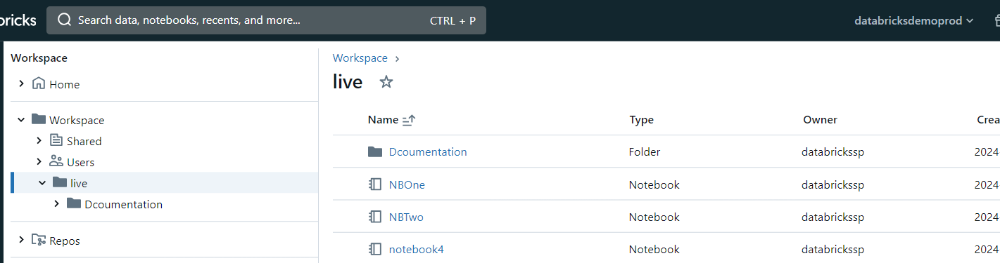'  


